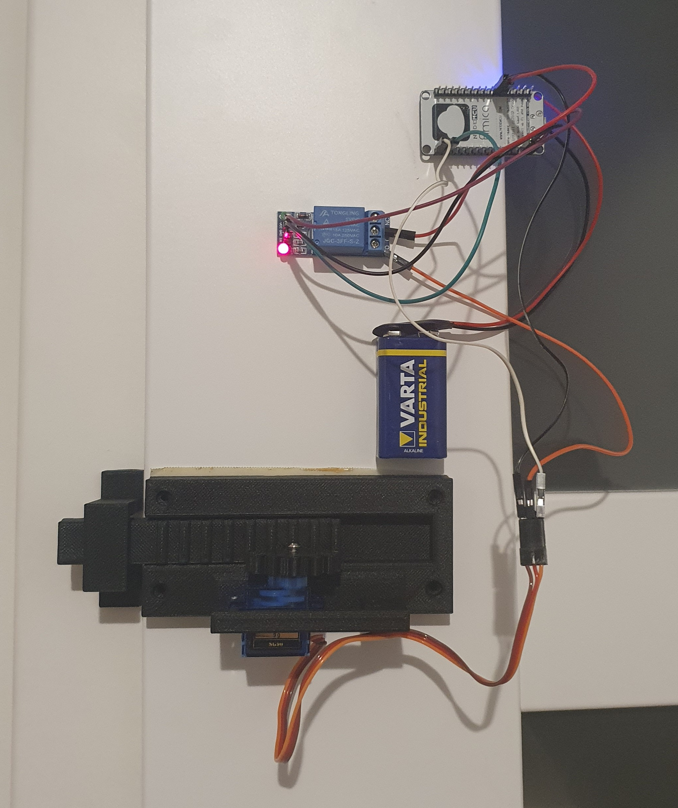

- [Video preview](https://youtu.be/gyzmUrlfdGA)
- [Sketch](Sketch.ino)
- [Wiring diagram](Wiring.jpg)
- Relay has been used to completly cut off servo power (in my case it buzzes all the time)
- **9V battery meets NodeMCU 1.0 specification, however it may exceed max voltage for your board. If not, I still recommend additional cooling for voltage regulator (I used radiator meant for raspberry pi usb controller)**
- Use larger servo motor (mine is too small) to make a mechanism stronger in case when someone wants to open locked door

  

