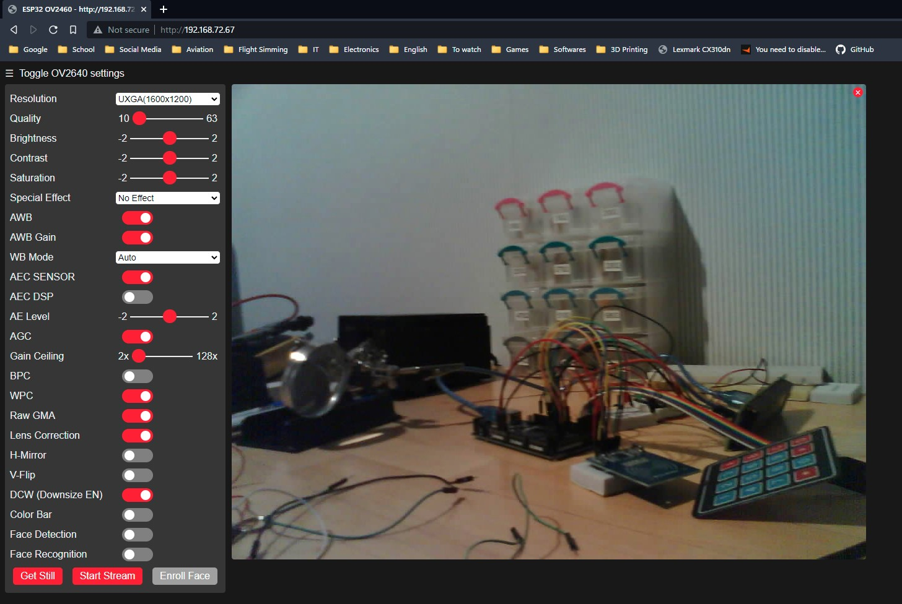

# Programming
ESP32 cam doesn't have an USB connector. You can use arduino or USB to TTL board to program it. I have used second option: [photo](USBtoTTL.jpg)

Connect GND to IO0 before uploading your code. Remove this connection after succesful upload.

[Sketch I used](Sketch.ino) (example web server)
# Camera feed
Open serial monitor and hard reset your ESP using button. It should print its IP address. Paste it in a web browser to view camera live preview.

- [Video preview](https://youtu.be/IdW3WE3cHsA)

  

