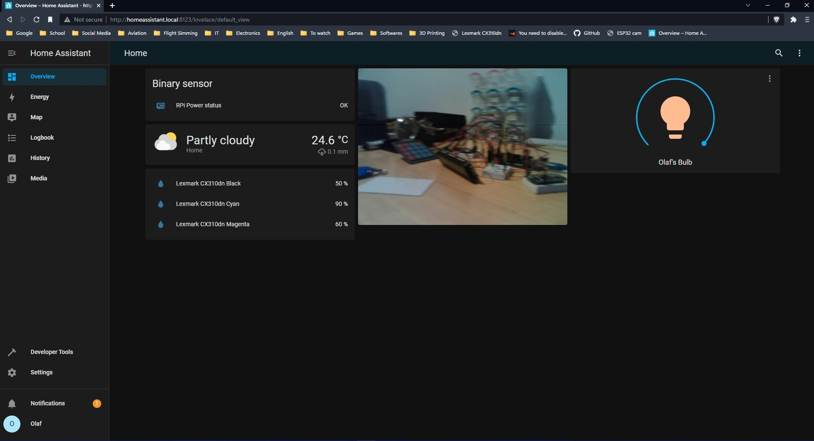

# Usage
I use Raspberry Pi to host a home assistant local web server ([link](https://www.home-assistant.io/)). It's great for integrating ESP32 with its dashboard. You can find compatible with HA sketch [right here](Sketch.ino) ([original link](https://RandomNerdTutorials.com/esp32-cam-video-streaming-web-server-camera-home-assistant/))

  

